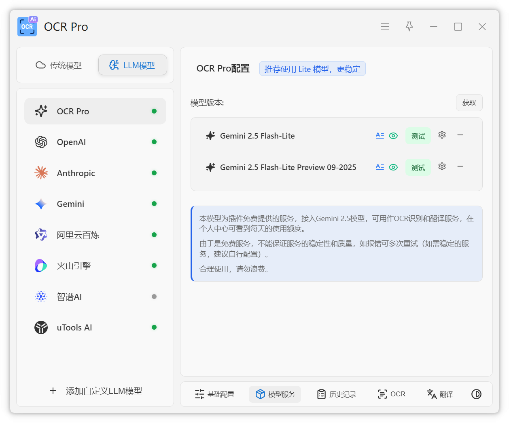

# LLM模型

配置大语言模型服务的 API。

## 支持的服务

- OpenAI
- Anthropic
- Gemini
- 阿里云百炼
- 火山引擎
- 智谱AI
- uTools AI

## 配置方法

每个服务需要配置对应的 API Key 和模型参数。详细的申请教程请参考 [服务申请](/service/overview) 页面。

::: tip 提示
LLM 模型通常提供更智能的翻译和文字处理能力。
:::
