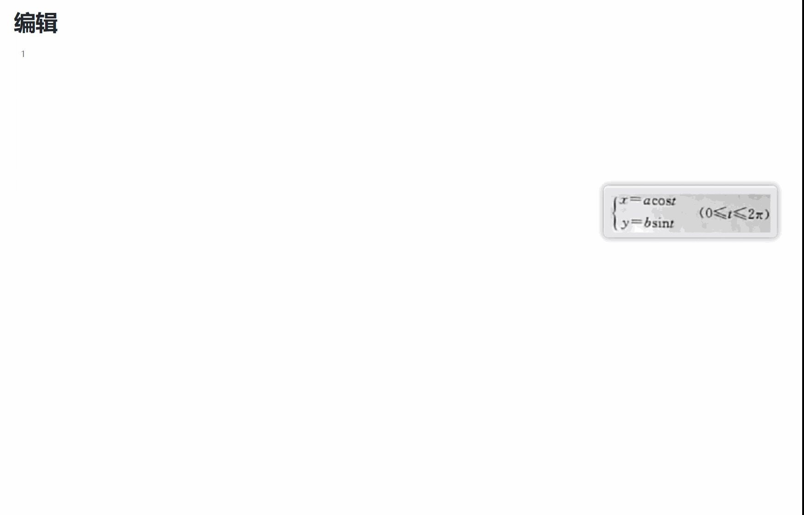
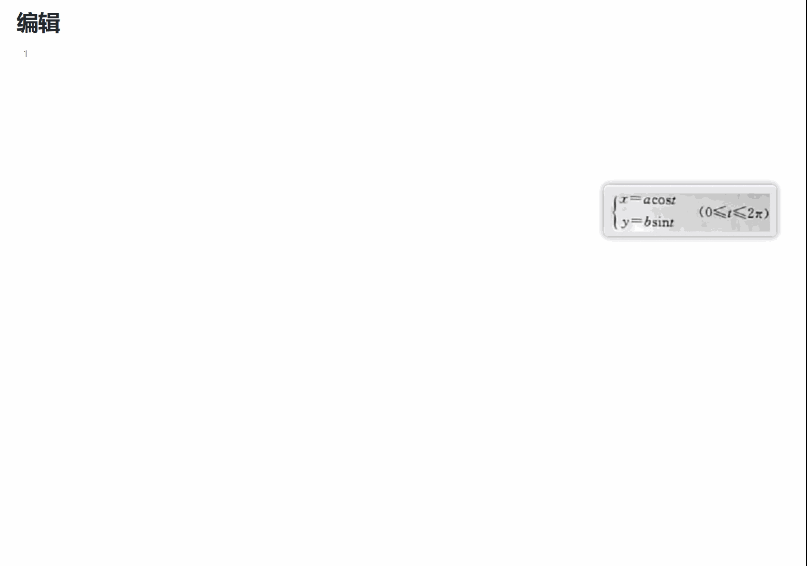

# 公式识别

OCR Pro 支持数学公式识别，可以将图片中的公式转换为 LaTeX 格式。

## 功能特点

- 支持复杂数学公式
- 输出标准 LaTeX 格式，实时渲染、一键修改
- 支持鼠标直接手写公式识别

## 使用方式

### 截图公式识别

1. 呼出 uTools
2. 输入 `公式识别`
3. 框选公式区域
4. 复制 LaTeX 代码

### 手写公式识别

1. 呼出 uTools
2. 输入 `手写公式识别`
3. 使用画板手写公式
4. 复制 LaTeX 代码

