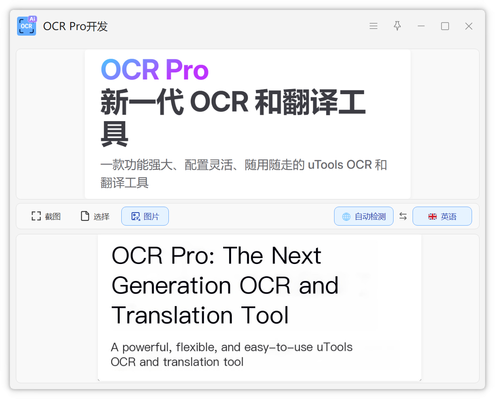

# 图片翻译

OCR Pro 支持直接翻译图片中的文字，保持原图布局。

## 使用方式

### 截图图片翻译

1. 呼出 uTools
2. 输入 `截图图片翻译`
3. 框选需要翻译的区域
4. 查看翻译结果

### 图片文件翻译

1. 拖拽图片文件到 uTools
2. 选择 `图片翻译`
3. 查看翻译结果

### 剪贴板图片翻译

1. 复制图片到剪贴板
2. 呼出 uTools
3. 输入 `剪切板图片翻译`

::: warning 注意事项
图片翻译目前只支持 百度智能云翻译服务，需要提前配置好

后续会继续开发

:::
