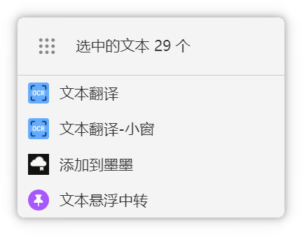
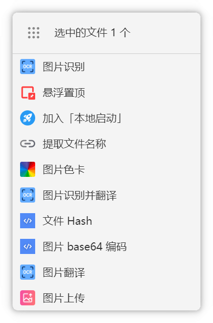

# 匹配指令

匹配指令允许你通过特定的文本模式触发插件功能。

## 什么是匹配指令

匹配指令是一种自动化触发机制，当你复制或选中的文本符合预设的模式时，插件会自动执行相应的操作。

## 命令列表

| 命令             | 说明             | 触发方式                   |
| ---------------- | ---------------- | -------------------------- |
| `文本翻译`       | 翻译选中文本     | 选中文本后超级面板自动匹配 |
| `文本翻译-小窗`  | 小窗翻译选中文本 | 选中文本后超级面板自动匹配 |
| `图片识别`       | 识别图片文件     | 选中图片后超级面板自动匹配 |
| `图片识别并翻译` | 图片 OCR 后翻译  | 选中图片后超级面板自动匹配 |

::: tip 提示
合理配置匹配指令可以大幅提升你的工作效率。
:::
