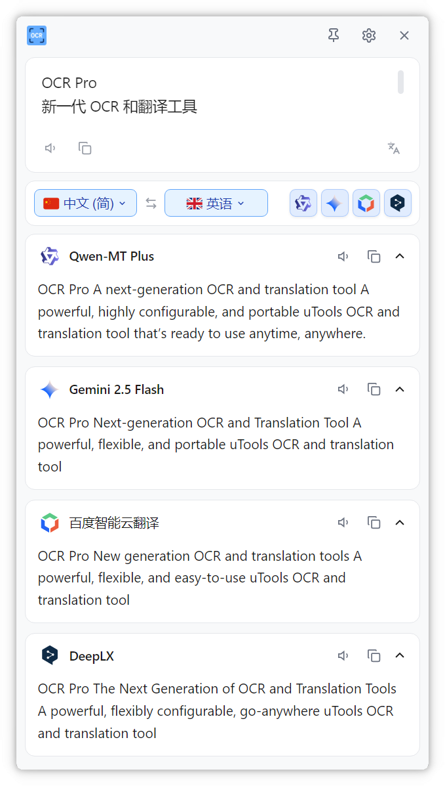

# 小窗翻译

小窗翻译是一个独立的悬浮翻译窗口，小巧便捷，更利于对比翻译

## 使用方式

### 打开小窗翻译

1. 呼出 uTools
2. 输入 `小窗翻译`
3. 弹出独立悬浮窗口

### 翻译剪贴板文本

1. 复制需要翻译的文本
2. 呼出 uTools
3. 输入 `翻译复制的文本-小窗`

## 多模型翻译

支持同时配置多个翻译模型 同时查看多个模型的翻译结果，选择最佳翻译。
