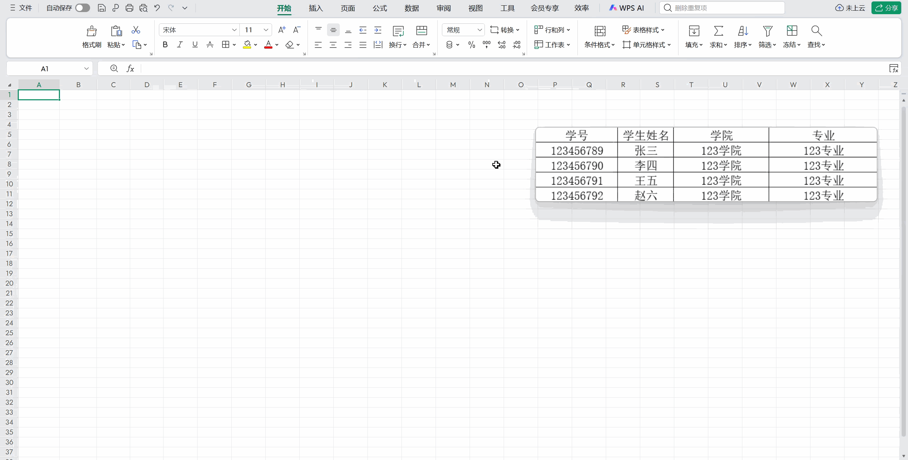

# 表格识别

OCR Pro 支持专业的表格识别功能，可以识别图片中的表格并保持其结构。

## 功能特点

- 高度还原表格结构
- 支持导出为 **excel 格式**、**markdown 格式**
- 支持实时渲染、一键修改

## 使用方式

1. 呼出 uTools
2. 输入 `表格识别`
3. 截取包含表格的区域
4. 查看识别结果

   

## 支持的表格类型

- 有边框表格
- 无边框表格
- 合并单元格表格
- 复杂嵌套表格

::: warning 注意
本地 OCR 模型不支持表格结构识别，只能识别表格中的文字。
:::
