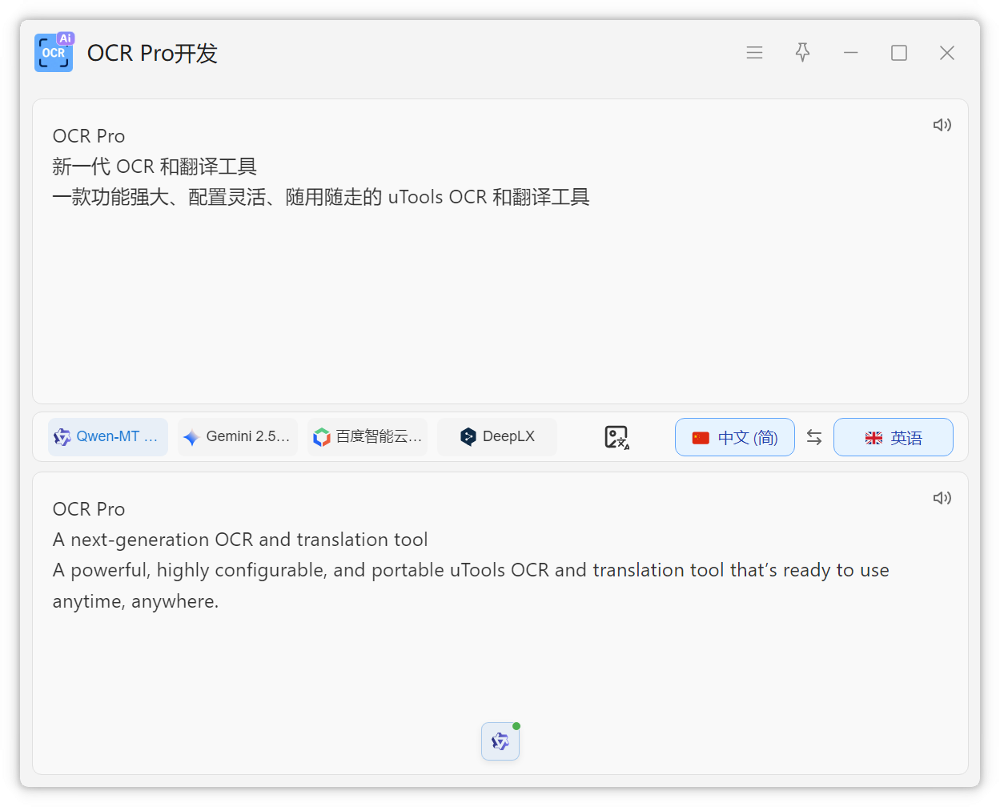
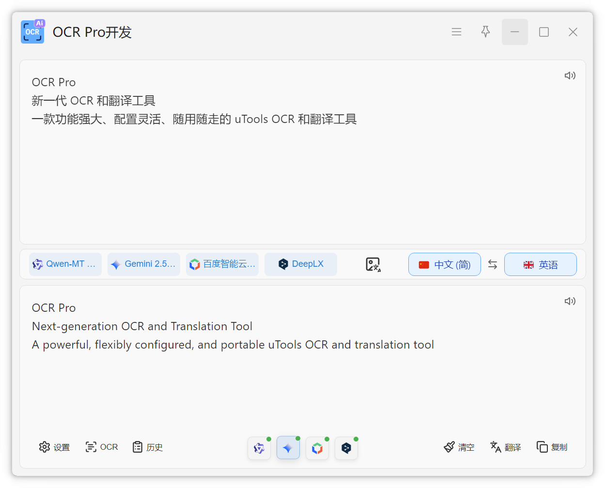

# 翻译功能

OCR Pro 集成了强大的翻译功能，支持文本翻译和 OCR 后翻译。

## 使用方式

### 直接翻译

1. 呼出 uTools
2. 输入 `翻译`
3. 进入翻译界面，输入需要翻译的文本
4. 点击翻译或按回车

### 选中文本翻译

1. 选中任意文本
2. 呼出 uTools
3. 选择 `文本翻译`

### 剪贴板翻译

1. 复制文本到剪贴板
2. 呼出 uTools
3. 输入 `翻译复制的文本`

### OCR 后翻译

截图识别后直接翻译：

1. 呼出 uTools
2. 输入 `截图识别并翻译`
3. 框选区域
4. 自动完成 OCR 并翻译

## 多模型翻译

OCR Pro 支持同时配置多个翻译模型
同时查看多个模型的翻译结果，选择最佳翻译。

## 语言设置

在设置中可以配置：

- **源语言**：自动检测或指定语言
- **目标语言**：翻译目标语言

## 自动翻译

开启自动翻译功能后：

- **结束编辑后自动翻译**：输入完成后自动触发翻译
- **即时自动翻译**：输入过程中实时翻译

