# 阿里云

::: warning 注意
由于信息的时效性，本文的步骤可能会过时，请以最新官方文档为准

官方文档：https://help.aliyun.com/document_detail/96384.html

:::

## OCR 服务

| 服务           | 免费额度  | 月调用量<=1万 | 1万<月调用量<=10万 | 查看详情                                                     |
| -------------- | --------- | ------------- | ------------------ | ------------------------------------------------------------ |
| 通用文字识别   | 200次/月☘️ | 0.0825        | 0.0495             | [点此跳转](https://help.aliyun.com/zh/ocr/product-overview/free-quota) |
| 全文识别高精版 | 200次/月☘️ | 0.225         | 0.09               | [点此跳转](https://help.aliyun.com/zh/ocr/product-overview/free-quota) |
| 表格识别       | 200次/月☘️ | 0.0825        | 0.0495             | [点此跳转](https://help.aliyun.com/zh/ocr/product-overview/free-quota) |

## 1. 注册登录

[点击此处跳转网页](https://www.aliyun.com/)，注册账号并登录（如需实名认证，按提示完成即可）

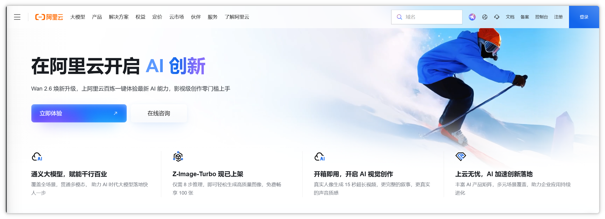

## 2. 开通 OCR 识别

进入 [「文字识别 OCR」](https://ocr.console.aliyun.com/overview) 页面，点击「通用文字识别」，然后点击「开通服务」

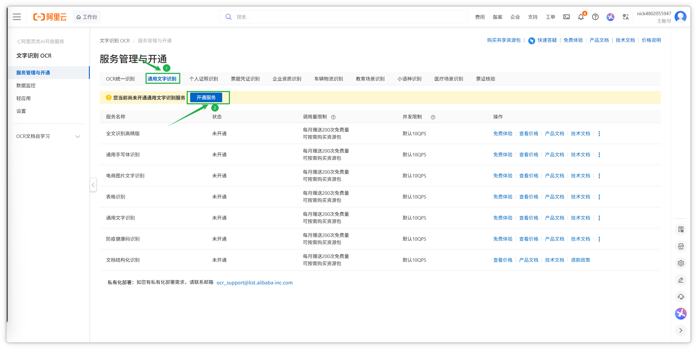

接下来会进入以下页面，点击「立即开通」

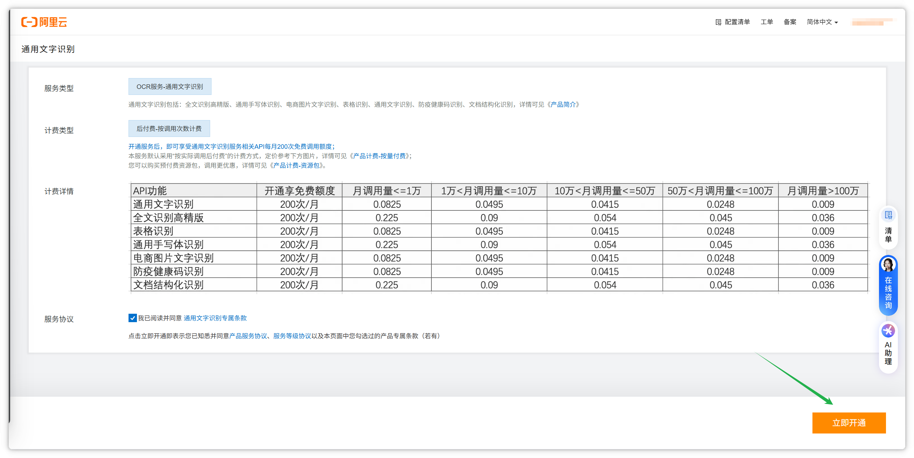

## 3. 获取秘钥

上一步开通成功后继续

注意，请妥善保管自己的秘钥，秘钥泄露可能会给你带来损失！

登陆阿里云后，鼠标划到右上角头像处，点击弹出菜单中的「AccessKey 」即可跳转秘钥管理页面

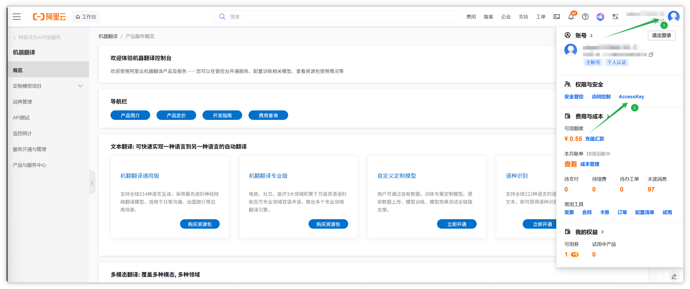

进入 [「秘钥管理」](https://ram.console.aliyun.com/manage/ak) 页面，点击「继续使用云账号 AccessKey」（如使用 RAM 用户 AccessKey 会更安全，但是也更复杂，具体方法自行搜索）

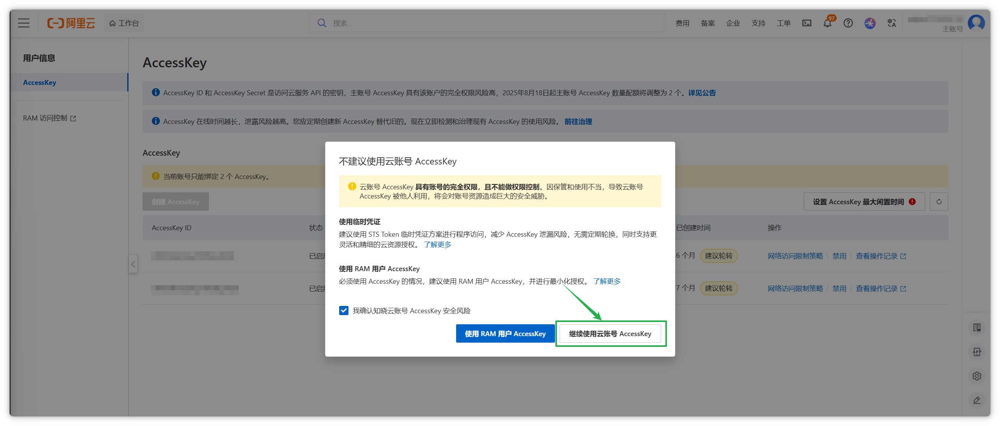

点击「创建 AccessKey」，在弹窗中勾选我确认，然后点击继续使用云账号 AccessKey

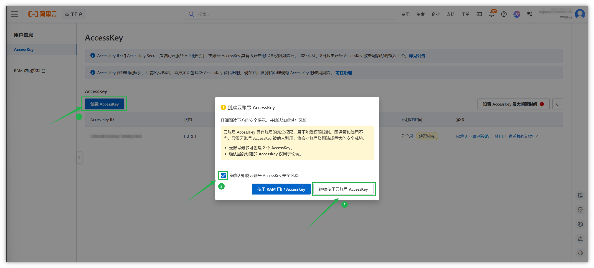

下图所示即为所需的秘钥，复制并保存好，勾选已保存，点击确认

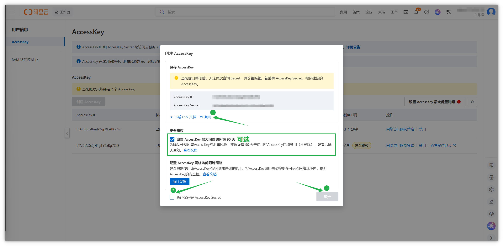

## 4. 填写秘钥

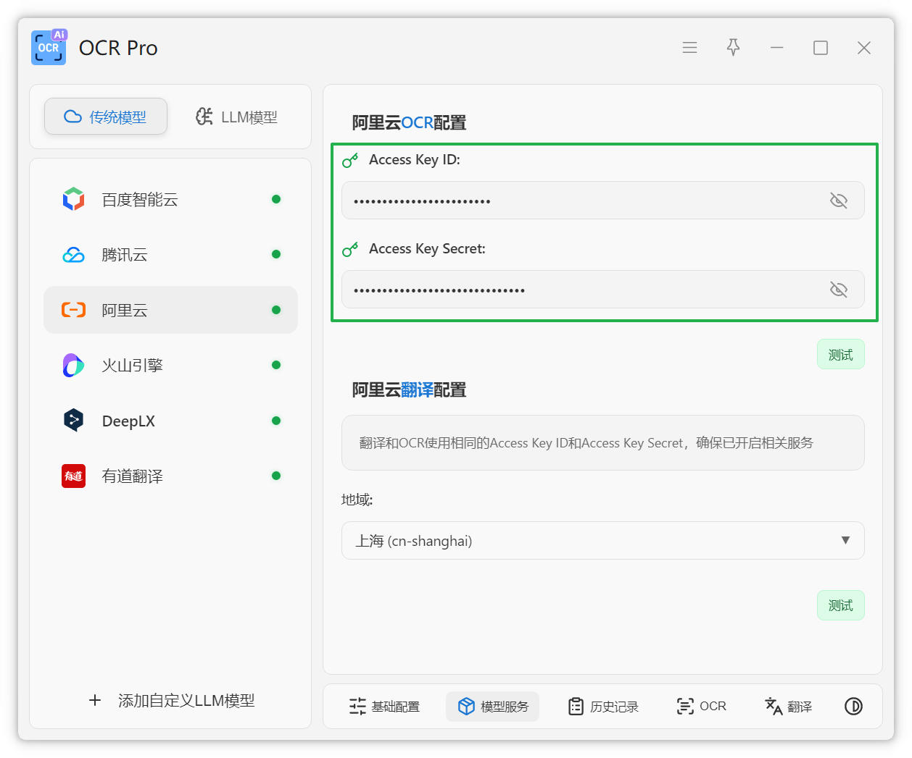

在 OCR Pro 的 模型服务 > 传统模型 中，选中「阿里云」，然后将刚才获取到的秘钥填写到对应位置即可。详细使用方法可查看 [OCR 默认模型](https://ocr.jlws.top/config/ocr-default.html) 页面和[默文本翻译认模型](https://ocr.jlws.top/config/translate-default.html) 页面。

## 常见问题

### OCR 服务

#### 1. 开通后无法立即使用

- 开通后需要等待 5-10 分钟才能生效
- 刷新页面或重新登录
- 检查是否已完成实名认证

#### 2. 免费额度用完了

- 可以升级到付费版本
- 查看 [阿里云 OCR 定价页面](https://help.aliyun.com/zh/ocr/product-overview/free-quota) 了解价格
- 可以创建多个应用来获得更多免费额度

#### 3. API 调用失败

- 检查 AccessKey ID 和 AccessKey Secret 是否正确
- 确认请求格式是否正确
- 检查图片大小是否超过限制（通常 4MB 以内）

#### 4. 识别精度不高

- 尝试使用「全文识别高精版」模型
- 确保图片清晰度足够
- 调整图片角度和光线

---

## 翻译服务

| 服务   | 免费额度        | 超出免费额度   | 并发请求数 | 查看详情                                                     |
| :----- | :-------------- | :------------- | :--------- | :----------------------------------------------------------- |
| 通用版 | 每月100万字符 ☘️ | 50元/100万字符 | 50次/秒    | [点此跳转](https://help.aliyun.com/document_detail/158294.html) |
| 专业版 | 每月100万字符 ☘️ | 60元/100万字符 | 50次/秒    | [点此跳转](https://help.aliyun.com/document_detail/158288.html) |

::: warning 注意
如果已经获取了 AccessKey，可以直接跳转到 「开通机器翻译」 部分
:::

## 1. 注册登录

[点击此处跳转网页](https://www.aliyun.com/)，注册账号并登录（如需实名认证，按提示完成即可）

## 2. 开通机器翻译

进入 [「文本翻译」](https://www.aliyun.com/product/ai/base_alimt) 页面，点击「立即开通」

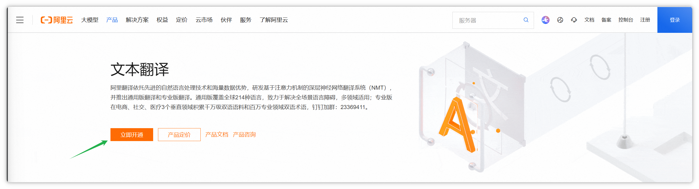

接下来会进入以下页面，点击「立即开通」

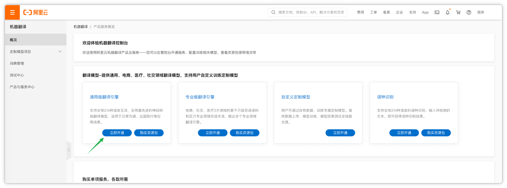

勾选「机器翻译服务协议」，点击「立即开通」

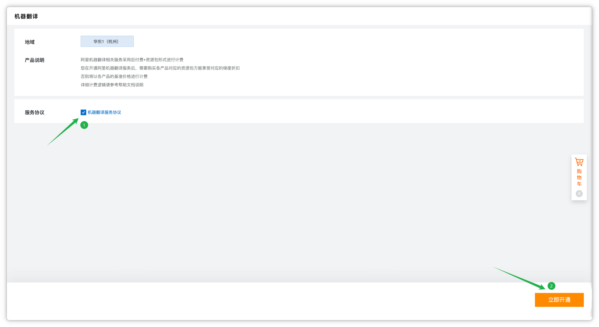

## 3. 获取秘钥

上一步开通成功后继续

注意，请妥善保管自己的秘钥，秘钥泄露可能会给你带来损失！

登陆阿里云后，鼠标划到右上角头像处，点击弹出菜单中的「AccessKey 」即可跳转秘钥管理页面

进入 [「秘钥管理」](https://ram.console.aliyun.com/manage/ak) 页面，点击「继续使用云账号 AccessKey」（如使用 RAM 用户 AccessKey 会更安全，但是也更复杂，具体方法自行搜索）

点击「创建 AccessKey」，在弹窗中勾选我确认，然后点击继续使用云账号 AccessKey

下图所示即为所需的秘钥，复制并保存好，勾选已保存，点击确认

## 4. 填写秘钥

在 OCR Pro 的 模型服务 > 传统模型 中，选中「阿里云」，然后将刚才获取到的秘钥填写到对应位置即可。详细使用方法可查看 [OCR 默认模型](https://ocr.jlws.top/config/ocr-default.html) 页面和[默文本翻译认模型](https://ocr.jlws.top/config/translate-default.html) 页面。
